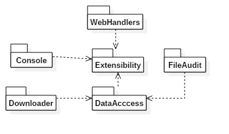
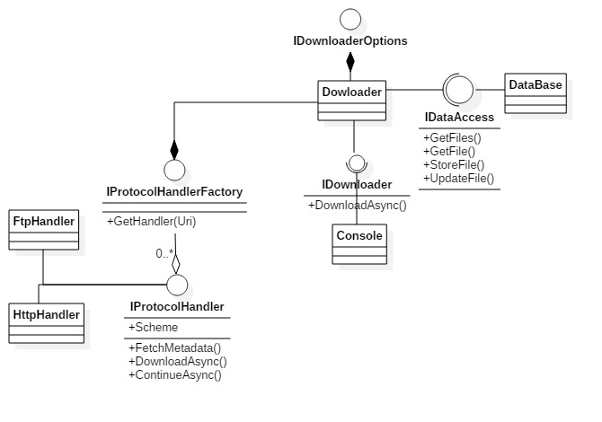

# Overview

This solution is compose of the following components

1. **Console**, That one is a console that consume the downloader.
2. **Downloader**, This library allows you to download files from different sources.
3. **Extensibility** It contains all interfaces of Downloader and interfaces for extending the Downloader.
4. **DataAccess** There is the implementation to connect with the database.
5. **FileAudit** WebServer project with WebAPI and frontEnd.
6. **WebHandlers** A couple of Protocol Handlers for the Downloader.

## Technologies

1. DotNet Standard and DotNetCoreApps, that allow the different components to be multi-platform (win, linux, darwin-os).
2. Extensibility, I decide to to choose [MEF], MEF2 is a little limited with version 1 because it is still being porting to dot net core, but still is very useful.
3. FrontEnd Mixing of dot net core middleware + WebAPI services + React-Redux.
4. Database, In that case LiteDB a no-SQL embedded.

## Architecture

### Components Diagram.



### Class Diagram



## Extensibility
As Its mention above, the mechanism to extend this components, it through,
Implementing your own version of the interfaces, and Exporting them.
You only need to put the new Dll, next to the console, you do not need to recompile.
Additionally, all the interfaces of interest to extend, are located in the Extensibility.dll,
Also if you want to replace the DataBase Only have to Implement the interface IDataAccess, in the same
dll mention above.


```csharp
 [Export(typeof(IProtocolHandler))]
    public class MyProtocolHandler : IProtocolHandler
    {
        /// <inheritdoc cref="IProtocolHandler"/>
        public IEnumerable<string> Scheme => new[] { "ssh" };
        ...
    }
```

### Pending Work

1. A lot of test cases to check edge cases. For example: network failure.
2. ContinueAsync is planned to work, however in the provided implementations is not possible to move the reader pointer to the last read position.
3. Pending Bug of MEF, seems it cannot resolve ImportingConstructor from container in a separate assembly.

[MEF]: https://docs.microsoft.com/en-us/dotnet/framework/mef/
